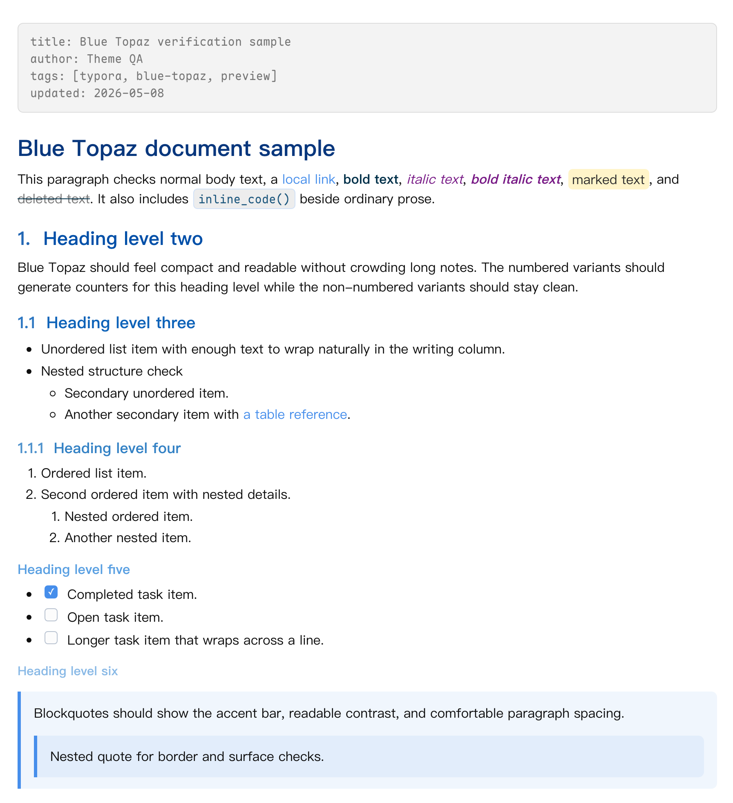
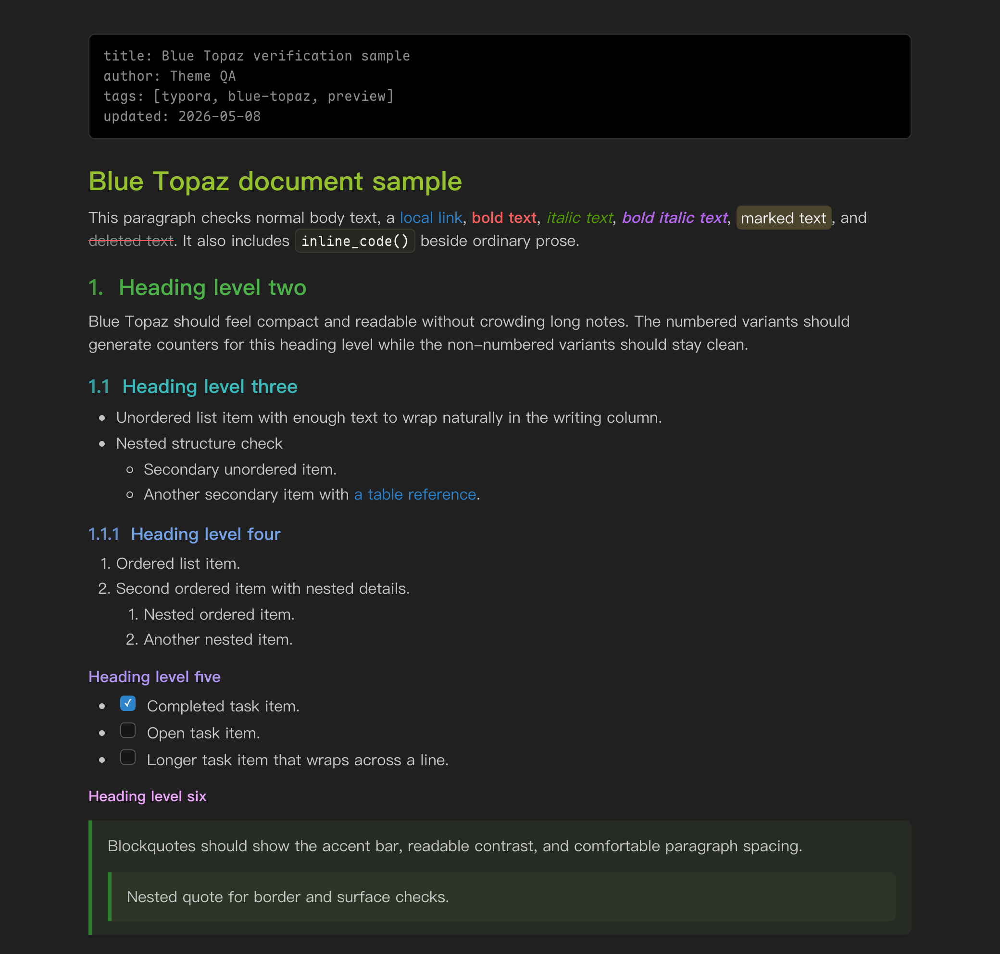
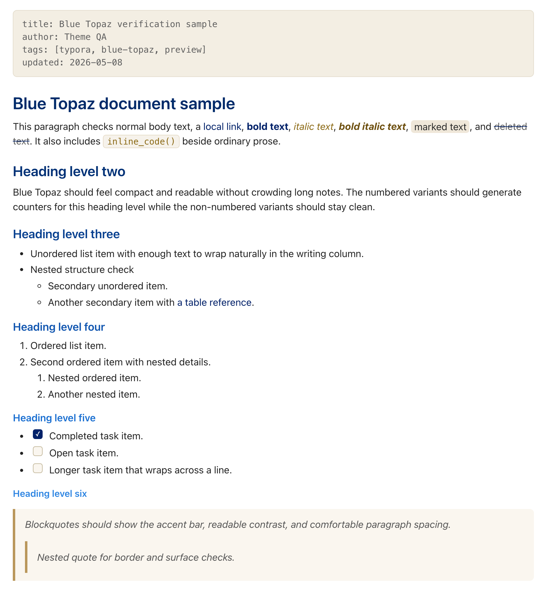

# Blue Topaz Typora Theme

Blue Topaz for Typora ports the readable writing-pane parts of the Blue Topaz Obsidian theme into several Typora theme variants:

- `blue-topaz.css`: light palette with generated heading numbers.
- `blue-topaz-nonum.css`: light palette without generated heading numbers.
- `blue-topaz-dark.css`: dark palette with generated heading numbers.
- `blue-topaz-dark-nonum.css`: dark palette without generated heading numbers.
- `navy-gold.css`: light "Navy Gold" palette adapted from an academic Quarto site (Emory navy + gold, GitHub-Dark code blocks, no heading numbers).

The shared styling lives in `blue-topaz/blue-topaz-base.css`. The entrypoint CSS files import that base file and set palette variables plus heading-number behavior.

## Installation

1. In Typora, open `Preferences` -> `Appearance` -> `Open Theme Folder`.
2. Copy the theme CSS files you want (`blue-topaz*.css` and/or `navy-gold.css`) into the theme folder.
3. Copy the `blue-topaz/` folder into the same theme folder (all themes share this base).
4. Restart Typora and choose a theme from the `Themes` menu.

## Callouts

All themes support GitHub-style alerts (callouts). Write them as a tagged blockquote — Typora renders the icon, label, and a coloured box automatically:

```markdown
> [!NOTE]
> Blue box — general asides.

> [!TIP]
> Green box — helpful suggestions.

> [!IMPORTANT]
> Purple box (navy in `navy-gold`) — key information.

> [!WARNING]
> Red box — cautions and gotchas.

> [!CAUTION]
> Red box — risks and negative consequences.
```

This uses Typora's native alert syntax, not Quarto's `::: {.callout-note}` fenced divs, and requires Typora 1.7 or newer. Callout colors are driven by `--bt-callout-*` variables in the base file, so a theme can recolor them by overriding those variables.

## Preview

The same sample document rendered under each theme. The `*-nonum` variants are identical except they drop the generated heading numbers.

### Blue Topaz — light (`blue-topaz.css`)



### Blue Topaz — dark (`blue-topaz-dark.css`)



### Navy Gold (`navy-gold.css`)

Emory navy + gold accents, GitHub-Dark code blocks, no heading numbers.



### Interactive comparison

For a live side-by-side of all four Blue Topaz variants, open `preview/blue-topaz-preview.html` in a browser, or serve the repository locally:

```sh
python3 -m http.server 8765
```

Then open `http://127.0.0.1:8765/preview/blue-topaz-preview.html`.

## Attribution

Partial styles are sourced or adapted from Blue Topaz:

- Blue Topaz Obsidian CSS: https://github.com/PKM-er/Blue-Topaz_Obsidian-css
- WhyI: https://github.com/whyt-byte
- pkmer.cn: https://pkmer.cn

Code block colors were also informed by Sublime/Monokai-style palettes during development.

## Font Assets

The public package only bundles fonts with redistributable licensing that should be suitable for a theme package. Bookerly and PingFang SC remain in the CSS font stack as local/system font preferences, but their font files are not bundled.
